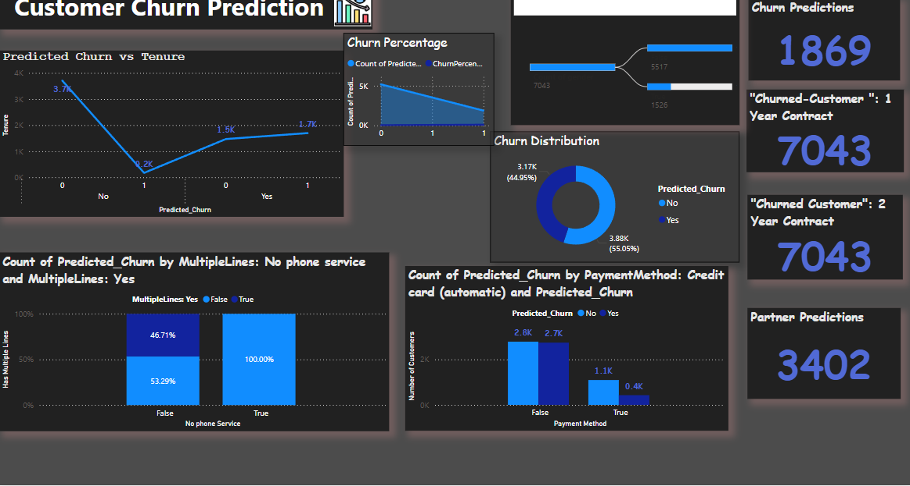

# Customer_Churn
**Project Overview**

This project explores customer churn using two primary approaches:

**Machine Learning Models**: Predictive modeling to identify at-risk customers.

**Power BI Dashboard**: Interactive visualizations for analyzing churn trends.

**Features**
Machine Learning:
Preprocessing and feature engineering.
Predictive models built using Python (Logistic Regression, Random Forest, etc.).
Evaluation metrics to measure model performance
Power BI Dashboard:
Insights into customer demographics, tenure, and billing patterns.
Interactive filters to explore churn trends by region, gender, and more.

**Dataset**
The dataset is sourced from Kaggle: Telco Customer Churn Dataset.

**Detailed Machine Learning Analysis**
**1. Exploratory Data Analysis (EDA)**
EDA was conducted using Power BI and Python to uncover key trends and relationships in the data.
  Key findings include:
Contract Types: Short-term contracts (month-to-month) showed the highest churn rates.
Payment Methods: Electronic checks correlated with higher churn rates.
Demographics: Senior citizens were more likely to churn compared to younger customers.
Internet Services: Fiber optic users showed a higher churn probability, while those without internet service rarely churned.
Additional Features: Customers with security, backup, and tech support services had lower churn rates.

**2. Data Preprocessing and Feature Engineering**
Handling Missing Values: Missing data was handled using imputation techniques.
Feature Encoding:
Categorical variables were encoded using methods like one-hot encoding and label encoding to make them suitable for machine learning algorithms.
Normalization: 
Numerical features like tenure and monthly charges were scaled for uniformity.

**3. Application of SMOTE for Balancing the Dataset**
The dataset was imbalanced, with significantly more customers in the "No Churn" category compared to the "Churn" category.
SMOTE (Synthetic Minority Over-sampling Technique) was applied to generate synthetic samples for the minority class, ensuring a balanced dataset.
To further enhance the balance, SMOTE-ENN (a combination of SMOTE and Edited Nearest Neighbors) was employed.
This method oversamples the minority class and cleans noisy samples from the dataset, improving the quality of the balanced data.

**4. Machine Learning Models**
Multiple algorithms were implemented to identify the best-performing model for churn prediction. These include:

*Logistic Regression*

*Random Forest Classifier*

*Support Vector Machines (SVM)*

*XGBoost*

*K-Nearest Neighbors (KNN)*

*Gradient Boosting Classifier*

**Evaluation Metrics**:

Models were evaluated using metrics such as Accuracy, Precision, Recall, F1-Score, and ROC-AUC.

**5. Model Comparison and Selection**

**Performance Before SMOTE-ENN**:
All models performed decently, but the imbalance in the dataset led to a bias towards the majority class.

**Performance After SMOTE-ENN:**
The application of SMOTE-ENN significantly improved model performance across all metrics.
**XGBoost** emerged as the best-performing model with the highest accuracy, F1-score, and ROC-AUC, making it the final choice for deployment.

**Key Features of the Dashboard**

**1. Overview of Churn Trends**
Visualizations highlighting the churn rate across different customer segments.Metrics such as overall churn percentage and customer distribution.

**2. Demographic Analysis**
Breakdown of churn rates based on age groups, senior citizen status, and gender.

**3. Service-Based Insights**
Analysis of internet services and additional features (e.g., security, backup, and tech support).
Insights into how specific services influence customer retention.

**4. Contract and Payment Method Analysis**
Churn trends across contract types (month-to-month, one-year, two-year).
Impact of payment methods (electronic checks, credit cards, etc.) on churn likelihood.

**5. Tenure and Monthly Charges**
Relationship between customer tenure, monthly charges, and churn rates.
Identification of high-risk customer groups based on these metrics.

**Key Insights from EDA**

*Short-term Contracts*: Higher churn rates; month-to-month contracts increase churn likelihood by 6.31x.
Tenure: Customers with longer tenure are significantly less likely to churn.
*Payment Method*: Electronic check payments show the highest churn rates, whereas credit cards reduce churn.
Internet Services: Customers using Fiber Optic internet have a higher churn rate, while those without internet services rarely churn.
Senior Citizens: Higher churn rates compared to younger customers.
Additional Features: Security, backup, device protection, and tech support reduce churn likelihood.

**Conclusion**

The dashboard serves as a powerful tool to understand customer behavior and identify factors driving churn. By addressing the identified high-risk factors, businesses can enhance customer retention and reduce churn rates.

